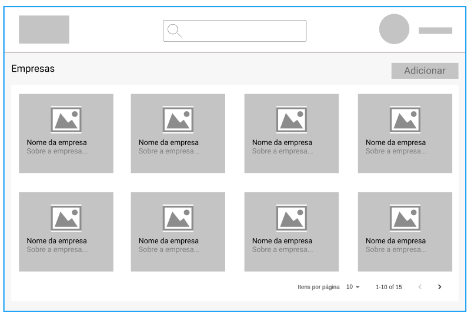

## Desafio
  Você foi designado para acrescentar uma nova feature ao sistema. 

  Nessa atividade deve ser adicionado uma nova visualização do sistema para acesso de um determinado tipo de usuário, essa tela vai ser composta por uma barra superior contendo a logo, um campo de pesquisa e as informações do usuário logado, também fara parte dessa tela uma lista de cards com as informações das empresas cadastradas no sistema e ao clicar no card deve ser aberto uma visualização detalhada das informações.

## Protótipo
Segue o protótipo de baixa fidelidade da listagem:

-  Informações da empresa:
   - Nome
   - CNPJ
   - Demanda: valor monetário
   - Faturamento Anual
     - Até R$ 10 milhões
     - De R$ 10 a R$ 50 milhões
     - De R$ 50 a R$ 200 milhões
     - De R$ 200 a R$ 500 milhões
     - Acima de  R$ 500 milhões
   - Sobre
  
## Objetivos principais:

  ### Front-end
  1. Desenvolver os componentes necessários
  2. Construir layout da aplicação
  3. Criar listagem em estrutura de cards
  4. Possibilitar a paginação dessa lista
  5. Possibilitar a pesquisa dessa lista
  6. Criar tela para o cadastro da empresa
  7. Possibilitar visualização detalhada da empresa ao clicar no card
  

  ### Back-end
  1.  Estruturar o projeto para implementação de uma API Rest
  2.   Criar rotas de cadastro, atualização e exclusão da empresa.
  3.   Criar rota para listar as empresas e essa rota deve comportar pesquisa e paginação
  4.   Criar rota para retornar a informação de uma empresa cadastrada baseado no ID dela (/company/:id)

  #### Objetivos opcionais:
   - Adicionar o login a aplicação

## Tecnologias obrigatórias:

  - React com Typescript (componente com funções e hooks)
  - Node JS com Typescript (Express)
  - TypeORM
  - Postgresql
  - Git

## Avaliação

  - Pontos não detalhados na descrição podem ser implementados no formato que você julgar mais adequado.

  - Na avaliação do projeto será considerado a qualidade e organização do código, a estrutura adotada, as escolhas de cores e estilizações adotadas para a aplicados e o resultado final dela rodando.

  - Não é preciso disponibilizar a plicação ou o banco em nenhuma plataforma ou serviço, todo o processo de avaliação sera feito local. 

## Entrega:

  - Você deve disponibilizar a resolução do seu projeto em um repositório privado do Github adicionando o usuário murilodaluz como participante. 

  - Ou se preferir pode encaminhar o código para este e-mail, porem tome cuidado para enviar a pasta .git junto. 

  - Prazo para conclusão: 20 abril 2021 às 23:59